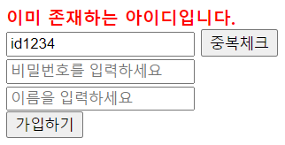
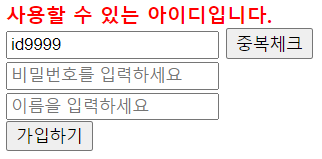

## Ajax 예제 

Ajax를 사용해 페이지의 이동 없이 간단한 아이디 중복검사 구현해보기.

- 로직 구현

  - register.jsp 에서 중복체크 버튼 누르면 `checkId()` 함수 호출, 가입하기 버튼 누르면 `sendit()` 함수 호출
    - `checkId()` : Ajax를 이용해 checkId_db.jsp로 POST 방식의 데이터 전송. AJAX_TEST_USER 테이블과 비교해 중복 여부 확인. 
    - `sendit()` : 각 input의 빈칸 여부와, 아이디 중복검사 여부, 아이디와 비밀번호 길이 제한 하는 유효성 검사. 모두 통과시 join_db.jsp로 이동해 AJAX_TEST_USER 테이블에 데이터 추가.
  - join_db.jsp 에서 테이블에 데이터 추가 성공시 login.jsp로 이동, 실패시 join_fail.jsp로 이동
- DB 사용 테이블

  - AJAX_TEST_USER 테이블

    - USERID, USERPW, USERNAME 컬럼
    - USERID 가 PK
- 사용 라이브러리
  - ojdbc6.jar

#### 실행 결과

- DB에 존재하는 아이디일 때

  

  

- DB에 존재하지 않는 아이디일 때

  

