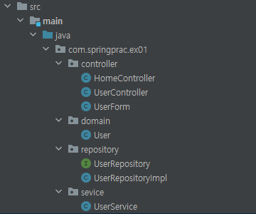

## 웹 애플리케이션 계층 구조 예제

컨트롤러, 서비스, 레포지토리 3계층으로 구성한 간단한 회원등록 예제

웹 계층 구조의 예제이므로, 기능구현 보다는 패키지 구조에 대한 이해에 중점을 둠

- 자바 부분 패키지 구조

  

  - Controller : 각 uri별로 응답에 대한 처리
  - Repository : user 등록이나 목록조회 같은 데이터 접근 
  - Service : 회원가입이나 중복 회원 검증 같은 비즈니스 로직

- 기타

  - 빈 등록은 어노테이션을 사용한 컴포넌트 스캔 방식으로 구현
  - Repository만 인터페이스와 구현체로 구현하고 Service는 그냥 클래스로 구현

#### 실행 결과

회원을 등록하고 목록보기를 하면 등록한 회원의 목록 잘 나옴.

> DB를 사용하지 않고 메모리상으로만 구현 했기 때문에 서버를 껐다 켜면 데이터 사라짐.
>
> 예외 페이지를 만들어주지 않아 이미 등록된 회원을 다시 등록하면 오류 발생.

